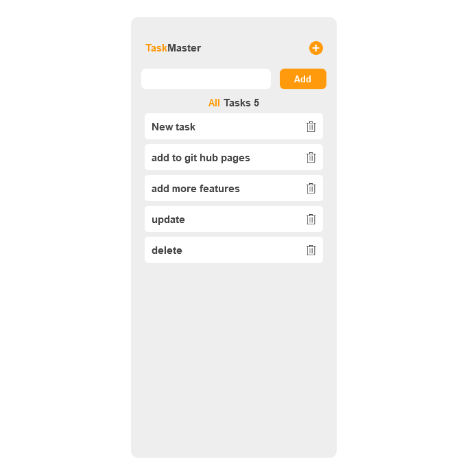

# Todo App Documentation

## Introduction

The Todo app is a web-based application that allow users to create and delete task.This documentation provides an overview of the features and functionality of the Todo app

## Features

The Todo app has the the following features:

### Task management

The Todo app allows users to perform the following operations:

- Create new task
- Read existing task
- Delete items

### Local Storage

The Todo app utilizes the browser's local storage to store task data

## Usage

### Creating A Task

- click on the "+" button
- Enter the task name in the provided input field
- Click on the "Add" button

### Deleting A Task

Click on the tash icon to delete

## Built with

- HTML
- CSS
- JavaScript
- Local Storage

## Additional Features (Upcoming)

The Todo app is continously evolving.

## Screenshot

## live Demonstration 
[Click here](https://kindnesskay.github.io/Todo/)
